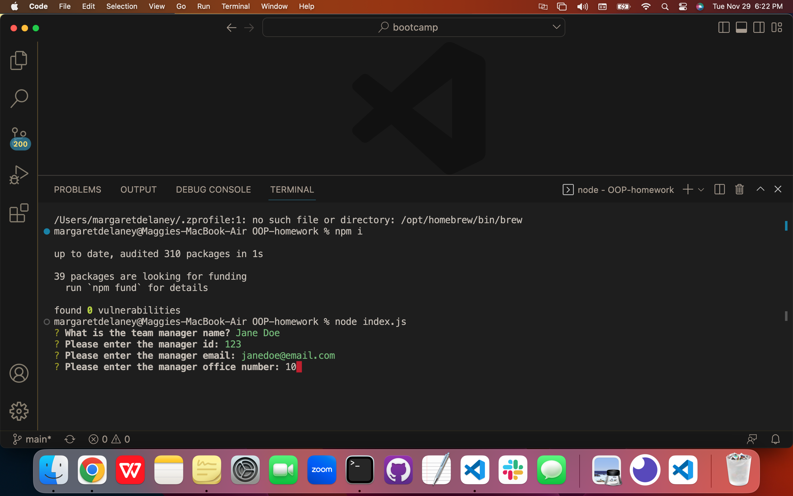
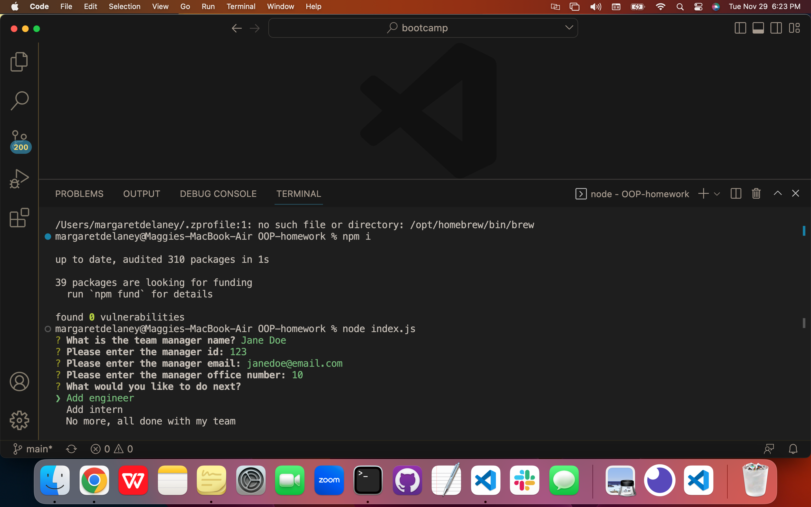
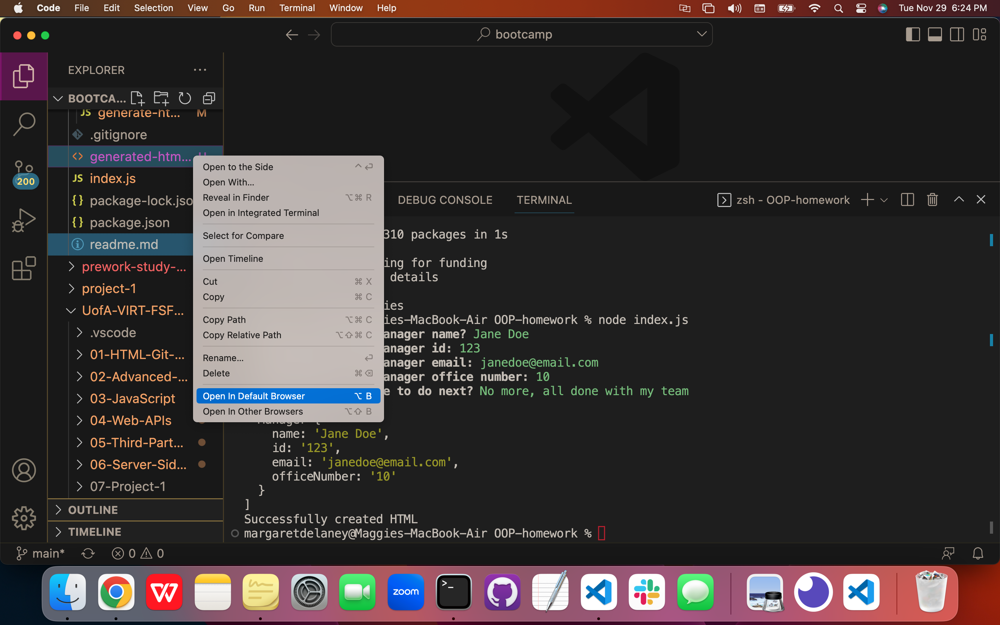
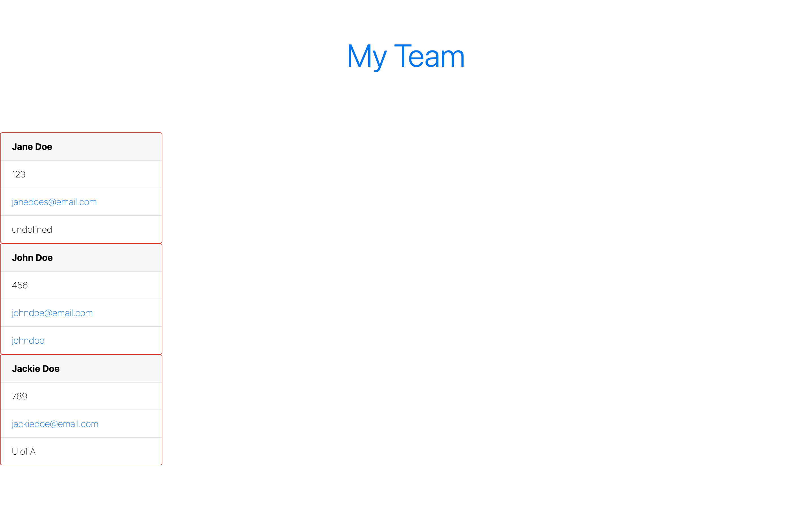
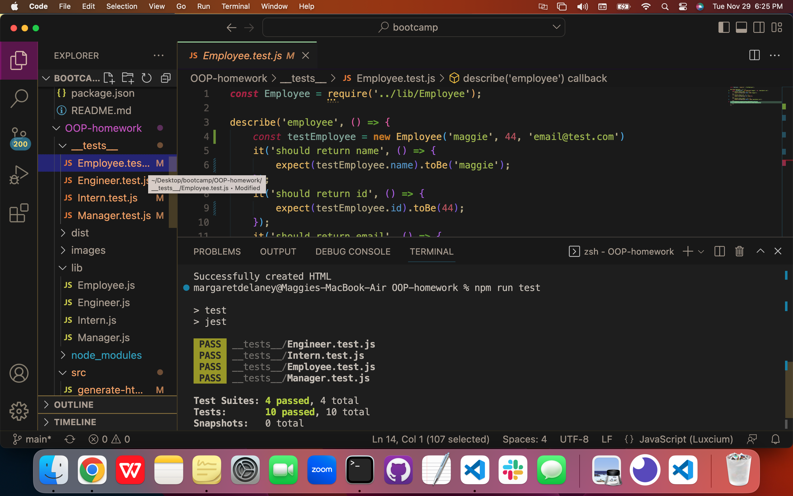

# OOP Homework: Team Generator

## Description

- Link to github repository: https://github.com/maggierdelaney/OOP-homework
- Link to screen castify demonstration video: https://drive.google.com/file/d/1kjpbaJ0po1tvnnZ99F_aiKX64QYNQHzf/view

This homework assignment met the following acceptance criteria:

GIVEN a command-line application that accepts user input, WHEN I am prompted for my team members and their information, THEN an HTML file is generated that displays a nicely formatted team roster based on user input
  - After all the prompts are answered and loaded with team member information, an HTML file ic created

WHEN I click on an email address in the HTML, THEN my default email program opens and populates the TO field of the email with the address
  - When you click on any team members email address, it will open your email program

WHEN I click on the GitHub username, THEN that GitHub profile opens in a new tab
  - When you click on an engineer's Github username, a new page will open to their portfolio

WHEN I start the application, THEN I am prompted to enter the team manager’s name, employee ID, email address, and office number
  - When you begin with tpying "node index.js" to start the program, you are immediately prompted with the above questions in the command line

WHEN I enter the team manager’s name, employee ID, email address, and office number, THEN I am presented with a menu with the option to add an engineer or an intern or to finish building my team
  - After you have answered each prompt for the manager's information, you are then prompted to select from a menu of "add engineer," "add intern," or to finish your team

WHEN I select the engineer option, THEN I am prompted to enter the engineer’s name, ID, email, and GitHub username, and I am taken back to the menu
  - When "add engineer" is selected, it then prompts you for the above information about this team member, once complete it returns to the main menu

WHEN I select the intern option, THEN I am prompted to enter the intern’s name, ID, email, and school, and I am taken back to the menu
  - When "add intern" is selected, it then prompts you for the above information about this team member, once complete it returns to the main menu

WHEN I decide to finish building my team, THEN I exit the application, and the HTML is generated
  - When "all done" is selected, an HTML is generated that will contain all the team members

## Table of Contents

- [Installation](#installation)
- [Usage](#usage)
- [Credits](#credits)
- [License](#license)
- [Badges](#badges)
- [Tests](#tests)

## Installation

1. First the files were created according to the suggest format from the instructions.

2. The index.js created the inquirer prompts that allowed the command line to be used for creating the team, as well as a writeFile function that was called from the generate-html file.

3. The generate-html file included code for the body of the HTML as well as the destructured items.

4. Four js files were created for the constructor of Employee, and class/extends for the Manager, Engineer and Intern which allowed similar data to be collect for each, but then with each its own specifically needed data.

5. Four tests were created to ensure the previous functions were working properly.

## Usage

1. Type "node index.js" into the command line.

2. You will be prompted with multiple questions to build your team, follow the prompts until you are done building. Then choose "No more, all done with my team".

3. A "generated-html.html" file will populate under the main folder, click "Open in default browser" to see your team roster.

4. To run the tests, open the integrated terminal, and type "npm test Employee" then repeat the same syntax for Engineer, Intern, and Manager. Scroll up in the terminal to see that they all passed.

## Credits

- Tutorial for classes: https://www.youtube.com/watch?v=fQ1oNTRdByA
- npm inquirer: https://www.npmjs.com/package/inquirer/v/8.2.4#questions
- Jest: https://jestjs.io/docs/getting-started

## License

Distributed under the MIT License.

## Badges

## Tests

To run the tests, open the integrated terminal, and type "npm test Employee" then repeat for Engineer, Intern, and Manager. Scroll up in the terminal to see that they all passed.